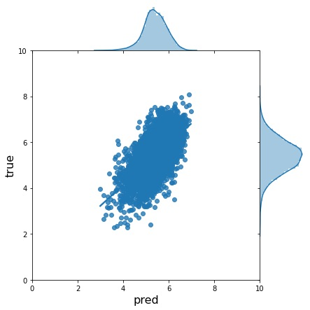
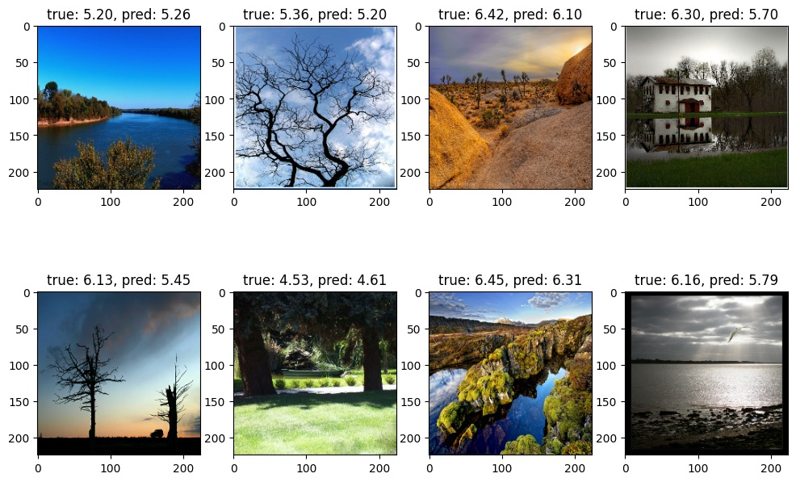

# Aesthetic Image
Train model to rate images.

## Download dataset
Download AVA dataset. Please refer https://github.com/mtobeiyf/ava_downloader.

## Convert annotation file
```
$ python convert_annotation.py \
    --annotation_path /path/to/AVA_dataset/AVA.txt \
    --image_dir /path/to/images
```

## Train model
```
# Train in local
$ python train.py \
    --train_csv /path/to/AVA_train.csv \
    --validation_csv /path/to/AVA_validation.csv \
    --image_dir /path/to/images \
    --batch_size 32 \
    --checkpoint_dir checkpoints/$(date "+%Y%m%d%H%M%S") \
    --log_dir logs/$(date "+%Y%m%d%H%M%S")
    
# Train with TPU
$ python train.py \
    --tpu_address grpc://${COLAB_TPU_ADDR}
    --train_csv gs://<bucket_name>/AVA_train.csv \
    --validation_csv gs://<bucket_name>/AVA_validation.csv \
    --image_dir gs://<bucket_name>/images \
    --batch_size 512 \
    --checkpoint_dir checkpoints/$(date "+%Y%m%d%H%M%S") \
    --log_dir gs://<bucket_name>/logs/$(date "+%Y%m%d%H%M%S")
```

## Results
Mean absolute error is `0.5684`.



Prediction results for landscape pictures from AVA dataset.


